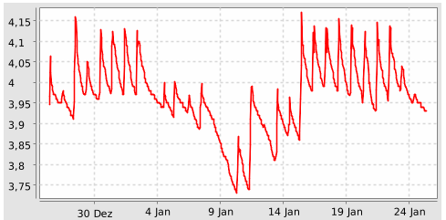
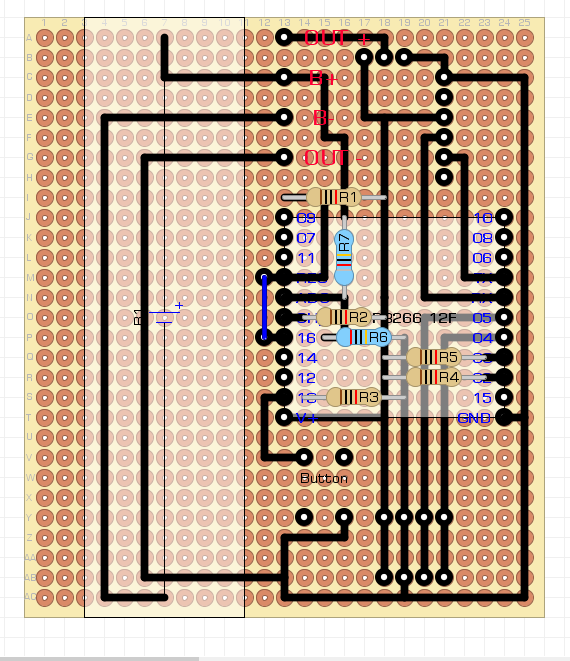

# ESP8266-OutDoorSensor
Build a Outdoorsensor with ESP8266 and BME280


I Setup a Weatherstation with a: <br>
ESP12F-Modul <br>
LiPo 18650 Cell <br>
BME280 <br>
Solarpanal 6V <br>
LiPo Akku 1A Charging Modul for 18650 with USB port and Under-/Overvoltprotection <br>
<br>
The Sensor work fine about more than an month without external recharge on the USB port

<br>
<br>
The OS on the ESP12 is the [Let´s Control it ESPEasy](https://github.com/letscontrolit/ESPEasy)<br>

The Sensor publish every 10 Minutes the Temperature, barometric pressure and humidity via MQTT to a Broker in my private Network.  

rule for ESPEasy:

```
On System#Boot do
timerSet,2,30     // timerset 30 after boot doo deepsleep
endon

on MQTT#Connected do
  Publish /%sysname%/IP,%ip%
timerSet,1,5      //Set Timer 1 for the next event in 10 seconds
endon  

On Rules#Timer=1 do  //When Timer1 expires, do
   if [DS_stop#State]=1
    Publish %sysname%/mess/temp,[mess#temp]
    Publish %sysname%/mess/humi,[mess#humi]
    Publish %sysname%/mess/press,[mess#press]
    Publish %sysname%/system/last_update,%systime%
    Publish %sysname%/system/vcc,%vcc%
    Publish %sysname%/system/rssi,%rssi%
    timerSet,2,15      //Set Timer 1 for the next event in 10 seconds
   else
    logentry Status ist 0
    timerSet,2,0
   endif
endon

On Rules#Timer=2 do  //When Timer1 expires, do
    logentry Enter DeepSleep
    deepsleep,600 
    
endon
```
The PCB i draw with DIY Layout Creator



(...to be continued)

